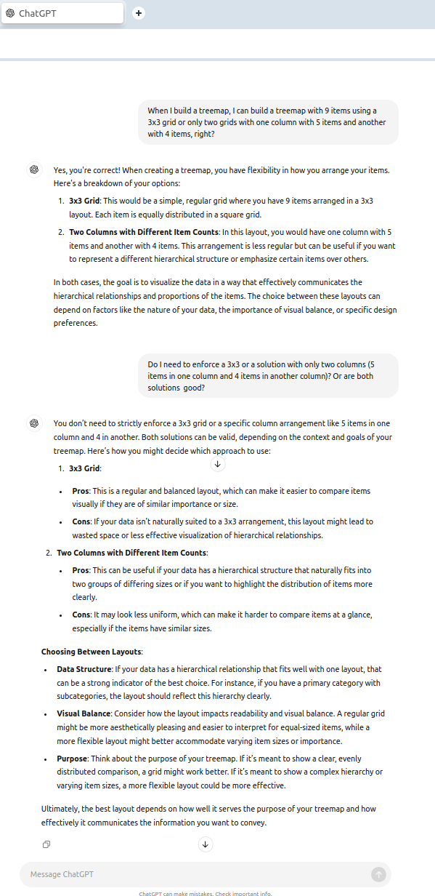

# Observation

As I will write the text in English, I will express the numbers in the notation adopted in US ("EUA" in brazilian portuguese). The thousand separator will be "," and decimal separator will be ".". We adopt the inverse in portuguese. 

# Note

After the initial solution I will make a [more flexible solution](#more-flexible-solution) in the end of this document.

# General

Let's think. We need to allocate all the parts in a big part, who needs to be a perfect rectangle (or a square).

I chatted with Chat GPT to try to understand better the problem. Let's talk about my understand:

We will try to build a treemap with the numbers 1, 2, 10, 20, 50.

The sum of these numbers is 1 + 2 + 10 + 20 + 50 = 83.

First of all, the proportions are in the are. In another words, the rectangle "2" needs to have the double of the `area` of the rectangle "1".

We need some assumptions, like the total `area`. We need to adopt the total `width`and `height`. Let's adopt 800x600 (`width` x `height`).

Thus, the total `area` will be 800x600 = 480.000.

The `area` of off all parts needs to be proportional. In another words:
- The sum of the parts is 83;
- The total `area` is 480,000.

Then we need a `scale` factor. The `scale` factor will be:
- 480.000/83 = 5,783.1325 (approximately)

Is a little obvios (kkk), but if we multiply the sum of the parts to the `scale` factor we will get the total ``area`:
(1 + 2 + 10 + 20 + 50) * 5,783.1325 = 479,999.9975 = 478,000

Proportionally, the `area` of the "1" part will be 5,783.1325

We defined that the total square has the 800x600 dimensions. The solution of Chat GPT adopted the 3 minor values on the left and the remainder 2 values on the `right`. We will adopt that we will have:
- If the total of the parts is an even number, then we will have half of the parts in the left and half of the parts in the right;
- If the total of the parts is an odd number, then we will have half of the parts + 0.5 in the left and half of the parts -0.5 in the right. Example: 5 parts - half of this value is 2.5. 2.5 + 0.5 = 3 and 2.5 - 0.5 = 2. 3 + 2 = 5;
- The lower values will be allocated in the left. And this will be result in a right solution? Yes, because the right part will be bigger in x aixis. 
 
"The general shape" of the general idea will be:

```
 __ ________
|__|        |
|  |________|
|__|        |
|  |        |
|  |        |
|  |        |
|__|________|

``` 

And more complex strucures, with more than 2 columns as example? We will not build this types of treemaps.

Let's return to our solution. We will have the `height` of 600. Thus the sum of the `height` of the three parts on the left will have the value 600. The dimension will be the same in this 3 parts. This way, proportionally, the `height` of the Y part "1" will be 1/(1 + 2 + 10) * 600 => 1/13 * 600 = 46.1538

We know that the total `area` of the "1" part will be 5,783.1325 as we calculated before. Then the `width` will be:

```
5,783.1325 / 46.1538 = 125.3013
```

To calculate the another ``areas` (not ``width`s` or ``height`s`) we need only the make a multiplication respecting the proportionality. In another words:
- "1" part: `area` will be 5,783.1325 x 1 = 5,783.1325 
- "2" part: `area` will be 5,783.1325 x 2 = 11,566.2650
- "10" part: `area` will be 5,783.1325 x 10 = 57,831.3250
- "20" part: `area` will be 5,783.1325 x 20 = 115,662.6500  
- "50" part: `area` will be 5,783.1325 x 50 = 289,156.6250

Let's verify. We need to have the sum of the parts equals to the total:
5,783.1325 + 11,566.2650 + 57,831.3250 + 115,662.6500 + 289,156.6250 = 479,999.9975

479999.9975 is approximately 480,000.0000

We verified the `area`. Seem that we are right until now.

Let's make another verification. The sum of the 3 y parts of the parts on the left needs to be equals to the total `height`. Reviewing the information of the `height` of the "1" part: 46.1538

As the `width` of the 3 parts are equals, we can mutiply proportionally the values on `height`. Then:
- 1 part: `height` = 46.1538
- 2 part: `height` = 92.3076
- 10 part: `height` = 461.5380

Testing the sum:
46.1538 + 92.3076 + 461.5380 = 599.9994 (approximately 600)

Ok, a little obvious in mathematics as:
x + 2x + 10x = 13x and 13 x 46.1538 = 599.9994

Ok, seems right until now...

We verified the total `height`. Remember, the `height` of the three blocks on the left is equals to the `height` of the two blocks on le right.

We need only to calcute the 2 last rectangles dimensions. We know that the `width` of the minor group of 3 rectangles is 125.3013

Than can calculate the `width` of the another part this way:
800 - 125.3013 = 674.6987

We already calculate the `area` of all the parts. Then we can calculate the `height`s:
- "20" part: `height` will be 115,662.6500 / 674.6987 = 171.4285
- "50" part:  `height` will be 289,156.6250 / 674.6987 = 428.5714

The sum of the calculated `height`s above is:
171.4285 + 428.5714 = 599.999 (approximately 600)

Ok, seems right

The rectangles will be:
- Part "1": 125.3013 x 46.1538  
- Part "2": 125.3013 x 92.3076 
- Part "10": 125.3013 x 461.5380  
- Part "20": 674.6987 x 171.4285
- Part "50": 674.6987 x 428.5714

Let's build the `PHP` script to make the `tree map`. We need first to install the `GD` extension, ok? Please see [this file](tests/manual/test-rectangle-1.php). You can see the result of this script [here](https://terceiro.com.br/treemap/test-rectangle-1.php).


# More flexible solution

After talking about my solution and thinking in the necessary rules that I have setted, I conclude that I don't need so strict rules.

First of all I talked with another person about this question: if I have 9 items, I can build a treemap with 3 columns (3 items in each column) or with 2 columns (one column with 5 items and another column with 4 items). I do not know the rule to apply to enforce one of that solutions and do not extract the definitive answer from another person, so I talked to Chat GPT. And Chat GPT said me:
.

So I can let the user to decide. Besides this user selection, we enforce the number of lines. We need to test a rules. Let's build the first rule:
- We will have at minimun 1 columns;
- We will have at maximun 4 columns. Why? Because think in 20 items. Is possible to build a treemap with 20 columns of 1 item, a little strange, right? How? adjusting the width of every column, respecting the height, that way the rectangle representing every item correspond proportionally to each value. We will try to make a draf under this message:

```
 _ _________
|_|_________|

```

I think you understood the general idea. So the user will can select the number of items, its values and the number of columns. The columns will vary beetween 1 and 4 and obvoiusly we can't allow that the number of columns to be great than the number of items.

And the user will can insert the total size in 2 fields, resulting in values like 1000x2000.

Let's try to use the canvas size 550x850 (width x height) and 6 items, making the solution varianting between the arrangment 2x3 and 3x2.

Let's start with 3x2.

The random values will be:
- 5
- 8
- 9
- 14
- 15
- 17

We will put the lower values at the right. If we have 7 values? I think that you already understood that this will not be a problem, as we already make a treemap with 5 items at the beggining of this document. We only need to put more items in one (or more) columns and we will adjust the width of the column and the height of the line. We dont need the entire line with the same height. Please see [this example](https://terceiro.com.br/treemap/test-rectangle-1.php). In this example you can see that:
- the width of every column vary. But all items in the column have the same width of the column;
- the height of the line is not the same. It vary for each item, as we need to adjust the area to be proportional of the value (**the porportion of each area item and the value its represent is the same**). 

We talked about a interesting thing. How to select the number of items in each column. The user will select the number of columns and not the number of items for every column.

Let's think in examples for three columns:
- 6 items: 3 coluns with 2 items (3x2 = 6);
- 7 items: 1 column with 3 items and 2 columns with 2 items (1x3 + 2x2 = 7);
- 8 items: 2 columns with 2 items and 1 column with 1 item (2x3 + 1x2 = 8);
- 9 items: 3 columns with 3 items (3x3 = 9).

The rule for 6 items, testing:

```
<?php
$numberOfColumns = 3; // prerequisite
$itemsPerColumns = []; 
$remainderItems = 6; // We will test after with another values

while ($numberOfColumns > 0) {
    if (count($itemsPerColumns) < $numberOfColumns) {
        $totalItem = ceil($remainderItems / $numberOfColumns )
    } else { // 
        $totalItem = ceil($remainderItems / $numberOfColumns )
    }
    $itemsPerColumns[] = $totalItem;
    $numberOfColumns--;
    $remainderItems -= $totalItem;

}
?>
```

Testing the solution for 6 items. First processing in the loop:
$itemsPerColumns = [2]; // totalItem = 6/3 = 2 .. $remainderItems = 6 - 2 = 4
$numberOfColumns = 2;

Second
$itemsPerColumns = [2, 2]; // totalItem = 4/2 = 2 .. $remainderItems = 4 - 2 = 2
$numberOfColumns = 1;

Third
$itemsPerColumns = [2, 2, 2]; // totalItem = 2/1 = 2 .. $remainderItems = 2 - 2 = 0
$numberOfColumns = 0; // Now exit the loop

Ok, another way to exit the loop is verifying the remainder items and not the number of columns, but ok, verifying the number of columns works.

Let's think in the solution for 7 items:
```
<?php
$numberOfColumns = 3; // prerequisite
$itemsPerColumns = []; 
$remainderItems = 7; // We will test after with another values

while ($numberOfColumns > 0) {
    if (count($itemsPerColumns) < $numberOfColumns) {
        $totalItem = ceil($remainderItems / $numberOfColumns )
    } else { // 
        $totalItem = ceil($remainderItems / $numberOfColumns )
    }
    $itemsPerColumns[] = $totalItem;
    $numberOfColumns--;
    $remainderItems -= $totalItem;

}
?>
```

Testing the solution for 7 items. First processing in the loop:
$itemsPerColumns = [3]; // totalItem = 7/3 = 2.33 (ceil = 3) ... $remainderItems = 7 - 3 = 4
$numberOfColumns = 2;

Second
$itemsPerColumns = [3, 2]; // totalItem = 4/2 = 2 (ceil = 2) ... $remainderItems = 4 - 2 = 2
$numberOfColumns = 1;

Third
$itemsPerColumns = [3, 2, 2]; // totalItem = 2/1 = 2 (ceil = 2) ... $remainderItems = 2 - 2 = 0
$numberOfColumns = 0; // Now exit the loop

Ok, still works. And for 8 items? Between solutions we are only modifying this line ($remainderItems = 6 // or 7 for 7 items), we will not repeat the code more, ok?

First processing of the loop
$itemsPerColumns = [3]; // totalItem = 8/3 = 2.66 (ceil = 3) ... $remainderItems = 8 - 3 = 5
$numberOfColumns = 2;

Second
$itemsPerColumns = [3, 3]; // totalItem = 5/2 = 2.5 (ceil = 3) ... $remainderItems = 5 - 3 = 2
$numberOfColumns = 1;

Third
$itemsPerColumns = [3, 3, 2]; // totalItem = 2/1 = 2 (ceil = 2) ... $remainderItems = 2 - 2 = 0
$numberOfColumns = 0; // Now exit the loop

Still works. Now for 9 items:

First processing of the loop
$itemsPerColumns = [3]; // totalItem = 9/3 = 3 (ceil = 3) ... $remainderItems = 9 - 3 = 6
$numberOfColumns = 2;

Second
$itemsPerColumns = [3, 3]; // totalItem = 6/2 = 3 (ceil = 3) ... $remainderItems = 6 - 3 = 3
$numberOfColumns = 1;

Third
$itemsPerColumns = [3, 3, 2]; // totalItem = 3/1 = 3 ... $remainderItems = 3 - 3 = 0
$numberOfColumns = 0; // Now exit the loop

Ok, the solution to select the number of items per column works.


